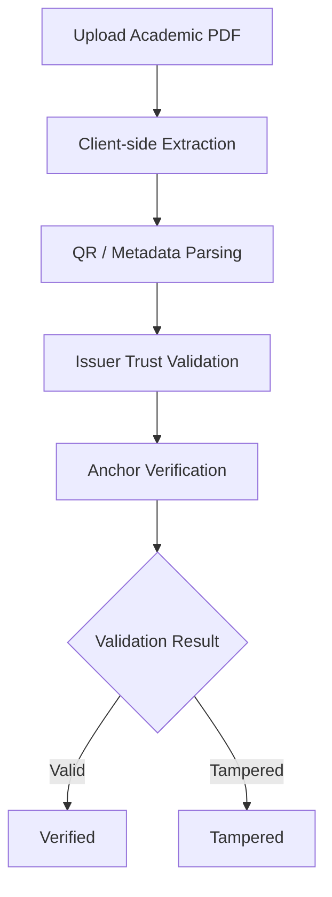
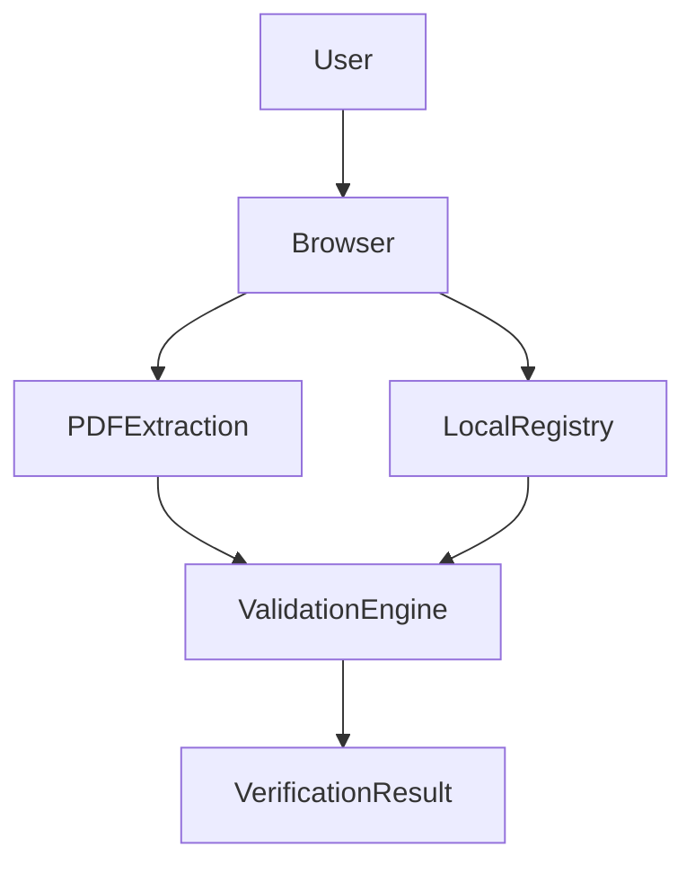
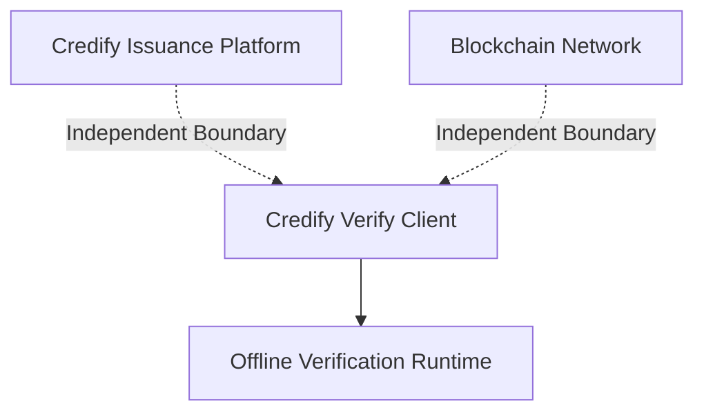
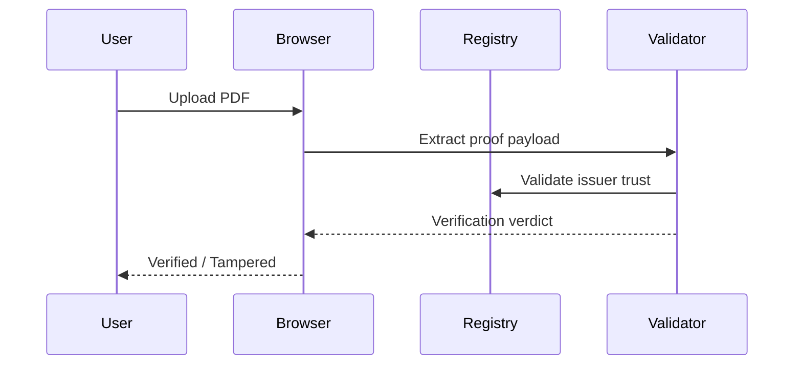

<div align="center">

<br/>

```txt
 ██████╗██████╗ ███████╗██████╗ ██╗███████╗██╗   ██╗
██╔════╝██╔══██╗██╔════╝██╔══██╗██║██╔════╝╚██╗ ██╔╝
██║     ██████╔╝█████╗  ██║  ██║██║█████╗   ╚████╔╝
██║     ██╔══██╗██╔══╝  ██║  ██║██║██╔══╝    ╚██╔╝
╚██████╗██║  ██║███████╗██████╔╝██║██║        ██║
 ╚═════╝╚═╝  ╚═╝╚══════╝╚═════╝ ╚═╝╚═╝        ╚═╝
```

```txt
██╗   ██╗███████╗██████╗ ██╗███████╗██╗   ██╗
██║   ██║██╔════╝██╔══██╗██║██╔════╝╚██╗ ██╔╝
██║   ██║█████╗  ██████╔╝██║█████╗   ╚████╔╝
╚██╗ ██╔╝██╔══╝  ██╔══██╗██║██╔══╝    ╚██╔╝
 ╚████╔╝ ███████╗██║  ██║██║██║        ██║
  ╚═══╝  ╚══════╝╚═╝  ╚═╝╚═╝╚═╝        ╚═╝
```

### Independent Offline Verification Client for Academic Credentials

<br/>

[](https://github.com/udaycodespace/credify-verify)
[](LICENSE)
[](https://github.com/udaycodespace/credify-verify)

<br/>

[](https://developer.mozilla.org/en-US/docs/Web/HTML)
[](https://developer.mozilla.org/en-US/docs/Web/CSS)
[](https://developer.mozilla.org/en-US/docs/Web/JavaScript)
[](https://pages.github.com/)

<br/>

> **Offline Verification · Deterministic Validation · Independent Trust Boundary**

> Browser-native academic credential verification engine designed for offline validation, tamper detection, and issuer trust verification without backend dependency.

<br/>

[Live Client](https://udaycodespace.github.io/credify-verify/) •
[Architecture](#-system-architecture) •
[Verification Workflow](#-verification-workflow) •
[Deployment](#-deployment) •
[Roadmap](#-development-roadmap)

---

</div>

# 📘 Overview

> [!NOTE]
> Credify Verify is an independent verification client engineered to validate academic credentials entirely inside the browser without relying on external APIs, centralized infrastructure, or runtime backend systems.

Traditional verification systems commonly fail under:
- backend downtime
- API dependency
- centralized verification bottlenecks
- institution-side availability issues
- network instability

Credify Verify removes those dependencies completely.

The verification engine:
- extracts credential proofs directly in-browser
- validates issuer trust locally
- checks credential integrity deterministically
- works offline for primary verification flows
- preserves an isolated trust boundary

---

# 🎯 Verification Philosophy

> [!IMPORTANT]
> A verifier that depends completely on an external server is not truly independent verification.
>
> Credify Verify shifts the verification trust boundary directly to the client runtime.

---

# ✨ Core Capabilities

<table>
<tr>

<td width="33%" valign="top">

## 🔍 Verification Engine

- Client-side PDF parsing
- QR payload extraction
- Deterministic proof validation
- Offline verification flows
- Tamper detection engine
- Browser-native execution

</td>

<td width="33%" valign="top">

## 🔐 Trust Model

- Local issuer trust registry
- Explicit trust boundaries
- Zero backend dependency
- No runtime authentication
- Independent validation logic
- Offline-first verification

</td>

<td width="33%" valign="top">

## ⚡ Runtime Design

- Zero framework overhead
- No package managers
- No external APIs
- Static deployment architecture
- Portable browser execution
- Minimal runtime complexity

</td>

</tr>
</table>

---

# 🏗️ System Architecture

> [!IMPORTANT]
> The verification engine is intentionally isolated from the credential issuance platform.
>
> Verification must remain operational even if the issuing infrastructure becomes unavailable.

---

## 🔄 Verification Workflow



---

## 🌐 Trust Boundary Model



---

## 🔐 Verification Isolation Model



---

# 🧠 Architecture Principles

<table>
<tr>
<th>Principle</th>
<th>Why It Exists</th>
</tr>

<tr>
<td><strong>Offline Verification</strong></td>
<td>Verification must continue functioning without internet or backend availability.</td>
</tr>

<tr>
<td><strong>Independent Trust Boundary</strong></td>
<td>Validation logic remains operational independently from issuance infrastructure.</td>
</tr>

<tr>
<td><strong>Deterministic Validation</strong></td>
<td>Verification results remain predictable, explainable, and reproducible.</td>
</tr>

<tr>
<td><strong>Zero Dependency Runtime</strong></td>
<td>Reducing runtime complexity improves portability and maintainability.</td>
</tr>

<tr>
<td><strong>Explicit Trust Mapping</strong></td>
<td>Issuer trust relationships remain human-readable and auditable.</td>
</tr>

</table>

---

# ⚙️ Verification Workflow

## 📌 End-to-End Validation Lifecycle



---

# 🔬 Core Mechanics

<table>
<tr>

<td width="50%" valign="top">

## 📄 Client-Side Extraction

- Parses academic PDFs directly in-memory
- Extracts embedded metadata
- Detects QR payloads
- Avoids external processing pipelines
- Preserves local-only execution

</td>

<td width="50%" valign="top">

## 🔐 Deterministic Validation

- Validates issuer identity
- Checks trust registry mappings
- Produces binary verification verdicts
- Detects tampered payloads
- Preserves audit-friendly verification

</td>

</tr>
</table>

---

# 🧩 Technical Stack

<div align="center">

## Frontend

| Technology | Purpose |
|---|---|
| HTML5 | Structure & rendering |
| CSS3 | Interface styling |
| Vanilla JavaScript | Verification engine |
| Browser APIs | File extraction & parsing |

---

## Runtime Architecture

| Layer | Decision |
|---|---|
| Backend | None |
| Database | None |
| Authentication | None |
| APIs | None |
| Deployment | Static hosting |

---

## Verification Infrastructure

| Component | Purpose |
|---|---|
| `trusted_issuers.json` | Local trust registry |
| QR Payloads | Verification anchors |
| Browser Memory Runtime | Local verification |
| Static Assets | Offline-first execution |

</div>

---

# ⚠️ Engineering Challenges

## 📄 In-Browser PDF Parsing

> [!WARNING]
> Most browser-side PDF tooling introduces unnecessary runtime weight and inconsistent parsing behavior across edge-case academic documents.

### Engineering Decisions

- lightweight extraction pipeline
- targeted academic document parsing
- reduced dependency footprint
- minimized runtime complexity
- browser-native execution

---

## 🔐 Trust Model Tradeoffs

> [!NOTE]
> A local trust registry is operationally simple but does not provide complete cryptographic trust finality.

### Future Direction

- signed trust registries
- issuer key rotation
- remote signature validation
- distributed trust synchronization
- enterprise-grade verification controls

---

# 🖼️ Interface Overview

## 📄 Scan Interface

<p align="center">
  
</p>

---

## ✅ Verification Success

<p align="center">
  
</p>

---

## ⚠️ Tampered Detection

<p align="center">
  
</p>

---

## 📘 Information & Documentation

<p align="center">
  
</p>

---

# 🚀 Deployment

> [!TIP]
> Since the system is fully static and dependency-free, deployment can be performed on nearly any static hosting provider.

---

## Requirements

- Chrome
- Edge
- Firefox
- Modern browser with File API support

---

## Local Development

```bash
# Clone repository
git clone https://github.com/udaycodespace/credify-verify.git

cd credify-verify

# Start local server
python -m http.server 8000
```

---

## Application Endpoint

```txt
http://localhost:8000
```

---

# 📂 Project Structure

```text
credify-verify/
│
├── index.html
│
├── data/
│   └── trusted_issuers.json
│
├── js/
│   └── app.js
│
├── pages/
│   ├── scan.html
│   ├── result.html
│   └── tampered.html
│
└── assets/
```

---

# 🧪 Validation Scenarios

## Supported Flows

- Offline PDF verification
- QR proof validation
- Issuer trust matching
- Tampered credential detection
- Air-gapped institutional verification

---

## Failure Detection

- Unknown issuer
- Invalid proof payload
- Missing trust mapping
- Corrupted metadata
- Modified credential structure

---

# 🛠️ Troubleshooting

> [!WARNING]
> Browser security restrictions can block local file access if the project is opened directly through the filesystem.

---

## Common Issues

### Unknown Issuer

The issuer metadata or public key is missing from:

```txt
data/trusted_issuers.json
```

---

### Browser Blocking APIs

Never open:

```txt
index.html
```

directly through:

```txt
file://
```

Always use a local HTTP server.

---

# 🛣️ Development Roadmap

## Planned Enhancements

- Client-side RSA signature verification
- Signed issuer trust registries
- Dynamic issuer key rotation
- End-to-end testing pipeline
- GitHub Pages CI/CD integration
- Enhanced tamper heuristics
- Blockchain anchor synchronization

---

# 👥 Governance & Access

> [!IMPORTANT]
> Structural modifications affecting the trust model or validation engine require architectural review before integration.

---

## Contribution Model

- Architecture-first review process
- Validation-focused contributions
- Controlled trust-boundary modifications
- Deterministic verification guarantees

---

# 👨‍💻 System Architect

<div align="center">

<table>
<tr>

<td align="center">

<a href="https://github.com/udaycodespace">


### Somapuram Uday
</a>

`Architecture`
`Verification Engine`
`Frontend`
`Trust Model`

💻 ⚡ 🔐

</td>

</tr>
</table>

</div>

---

# 📜 License

> [!NOTE]
> Proprietary — All rights reserved.

See:

```txt
LICENSE
```

for usage restrictions and ownership details.

---

<div align="center">

<br/>

**Built as an independent verification boundary for the Credify ecosystem**

<br/>

*Offline-first · Deterministic · Dependency-free*

<br/>

</div>
