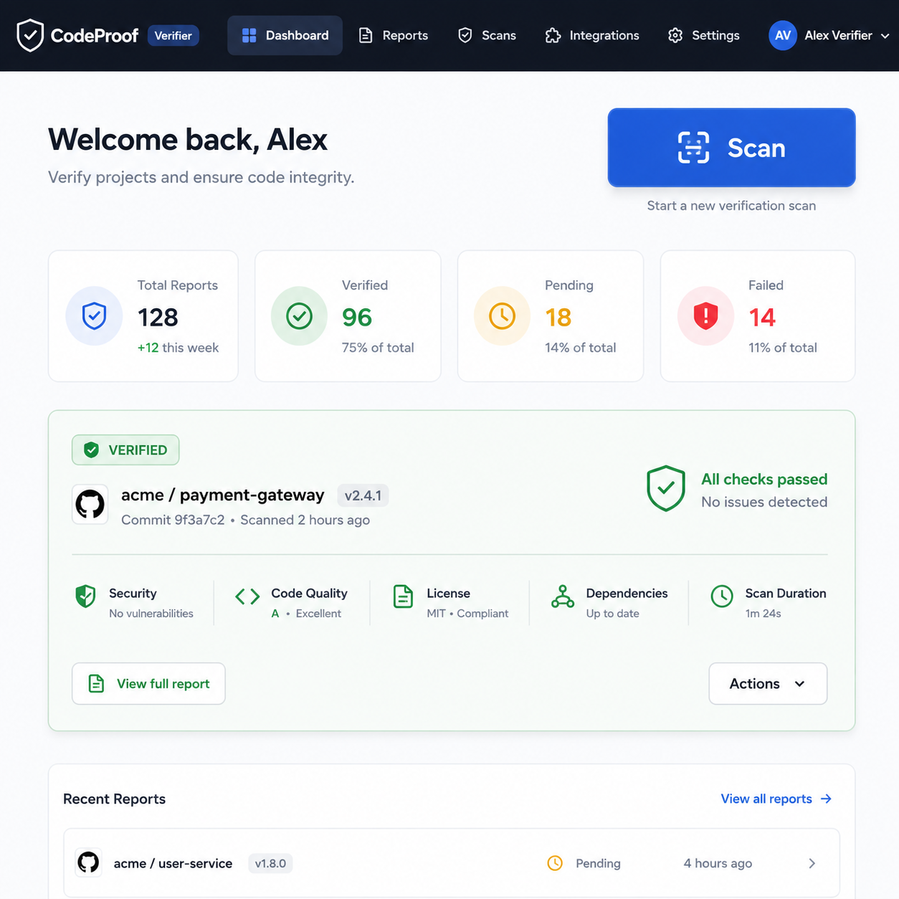
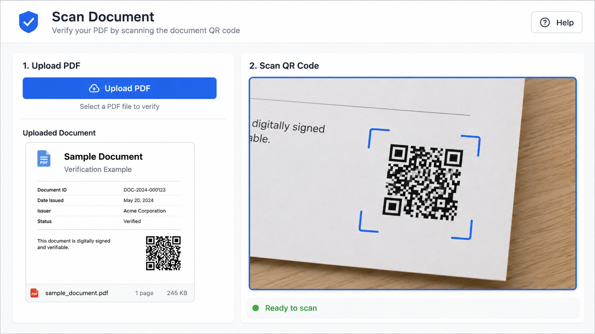
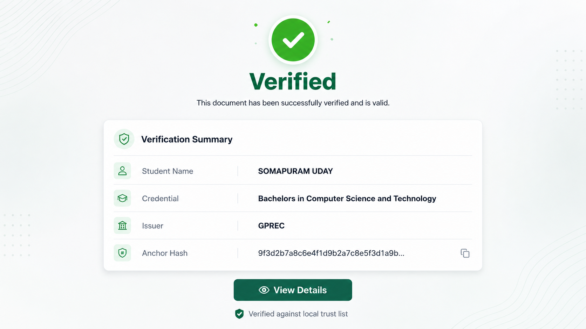
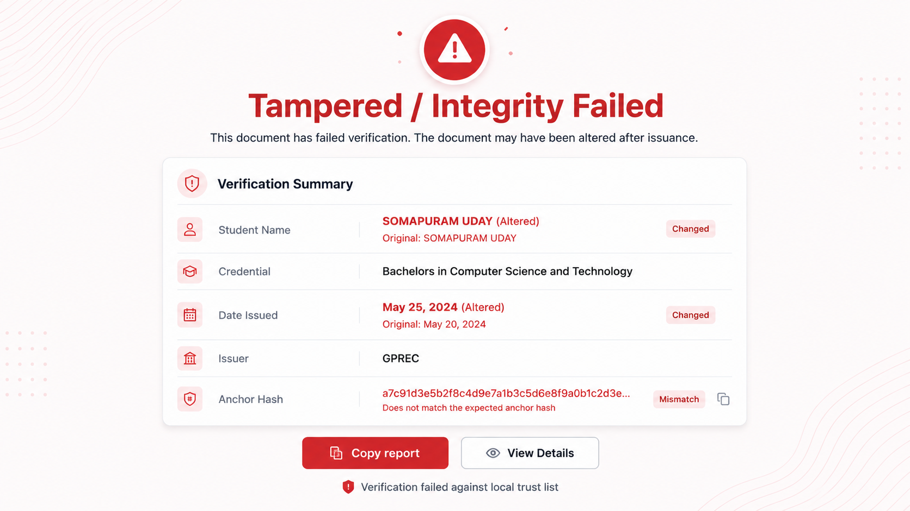

<div align="center">

# Credify Verify

**PDF academic transcript verifier for students and institutional verifiers.**

<br/>

   

<br/>

[**Live →**](https://udaycodespace.github.io/credify-verify/) &emsp; [**Docs →**](./docs) &emsp; [Report a bug](https://github.com/udaycodespace/credify-verify/issues/new) &emsp; [Request a feature](https://github.com/udaycodespace/credify-verify/issues/new)

</div>

<div align="center">
  
  <br/>
  <sub>Verifier dashboard · scan and result preview</sub>
</div>

---

## What this is

`Credify Verify` is a lightweight, static verification client that validates academic PDF credentials (transcripts/certificates) in the browser.

It extracts QR/proof data or embedded metadata from PDFs, checks credential anchors against a local trust list (`data/trusted_issuers.json`), and displays verified or tampered outcomes — all without a backend. This keeps the verification boundary independent from the issuance platform (`Credify`).

Built as a verification client to complement the `Credify` issuance platform and to provide an audit-friendly, offline-capable verifier for academic workflows.

Scope: single-repo static client intended for demo, validation, and integration testing.

---

## Stack

| Layer | Tech | Why |
|:---|:---|:---|
| Frontend | HTML, CSS, JavaScript (vanilla) | Small footprint, runs in any modern browser |
| Backend | None (static client) | Keeps verifier decoupled from issuance infrastructure |
| Database | None | Uses hashed anchors and local trust list |
| Auth | None required for verification | Verifiers don't need accounts to check proofs |
| Storage | Local files; supports IPFS references in payloads | Allows offline proof references |
| Deployment | GitHub Pages or any static hosting | Simple CI/CD for static assets |

---

## Features

- Upload or scan a student PDF to extract QR or embedded proof data.
- Validate credential anchor and issuer against `data/trusted_issuers.json`.
- Display verification outcomes: verified (`pages/result.html`) or tampered (`pages/tampered.html`).
- Offline-capable verification flow; works without a backend for basic checks.
- Informational pages: `pages/info/privacy.html`, `pages/info/support.html`, `pages/info/trust.html`.

---

## Architecture & key decisions

- Independent client: verifier is intentionally decoupled from the issuance service to reduce trust coupling and enable offline checks.
- Minimal footprint: purely client-side logic avoids server dependencies for primary verification flows.
- Trust model: relies on a locally curated `trusted_issuers.json` file; production-grade deployments should fetch signed trust-lists and perform cryptographic signature verification.

---

## What was hard

- **PDF extraction and QR parsing:** experimented with multiple JS libraries; settled on a lightweight approach to avoid large bundles.
- **Offline trust model:** balancing usability and security required keeping an editable local trust list while recommending signed remote lists for production.

---

## Screens

> Not deployed. Replace these with real screenshots when available.

| Scan PDF | Verified result |
|:---:|:---:|
|  |  |

| Tampered result | Info pages |
|:---:|:---:|
|  |  |

---

## Getting started

### Prerequisites

- A modern browser (Chrome / Edge / Firefox)
- Optional: Python to serve files locally

### Setup

```bash
# 1. Clone
git clone https://github.com/udaycodespace/credify-verify.git
cd credify-verify

# 2. Start a local static server (example)
python -m http.server 8000

# 3. Open in browser
# Open http://localhost:8000 in your browser
```

App serves static files from the repo root — no install step required.

---

## Project structure

```
credify-verify/
├── index.html
├── README.md
├── TEMPLATE.md
├── LICENSE
├── LICENSE-FAQ.md
├── CONTRIBUTING.md
├── assets/
│   ├── css/
│   └── screens/
├── data/
│   └── trusted_issuers.json
├── js/
│   └── app.js
└── pages/
    ├── scan.html
    ├── result.html
    └── tampered.html
```

---

## Troubleshooting

**Verification shows "unknown issuer"**
→ Cause: issuer not present in `data/trusted_issuers.json`.
→ Fix: add the issuer entry (public key and metadata) or contact the issuer's admin.

**Browser blocks file APIs when opened via `file://`**
→ Cause: browser security restrictions.
→ Fix: serve files via a local HTTP server (see Getting started).

---

## Known gaps

- No client-side RSA signature verification implemented in this repo (anchor/hash checks only).
- No automated test coverage for the static client.
- Mobile UX can be improved and accessibility audits are pending.

---

## Roadmap

- Add client-side RSA signature verification using issuer public keys.
- Support signed, hosted trust lists with key rotation.
- Add end-to-end tests and CI to publish to GitHub Pages.

---

## Contributing

Contributions are controlled — please see `CONTRIBUTING.md` for the process. Contact the owner before submitting code changes:

- GitHub: https://github.com/udaycodespace
- LinkedIn: https://www.linkedin.com/in/somapuram-uday/

---

## Status

 Actively maintained (demo/verification client).

---

## License

Proprietary — All rights reserved. See [LICENSE](./LICENSE) for details.

For licensing or permission requests: https://www.linkedin.com/in/somapuram-uday/

---

<div align="center">
  <sub>
    Built by <a href="https://github.com/udaycodespace">Somapuram Uday</a>
    &nbsp;·&nbsp;
    2026
    &nbsp;·&nbsp;
    Verification client for Credify v2
  </sub>
</div>